In this project, we'd demonstarte a Three-tier Architecture while also ensuring that the disks used to store files on the Linux servers are adequately partitioned and managed through programs such as gdisk and LVM respectively.

### Prerequisites
- A Laptop or PC to serve as a client
- An EC2 Linux Server as a web server (This is where you will install WordPress)
- An EC2 Linux server as a database (DB) serve

>Create an AWS instance using RedHat Distributionc

### Step 1 — Prepare the Web Server
1. Launch an EC2 instance that will serve as “Web Server”.
> I am going to be using AWS RedHat Distribution
2.  Create 3 volumes in the same availability zone as your Web Server EC2, each of 10 GiB 

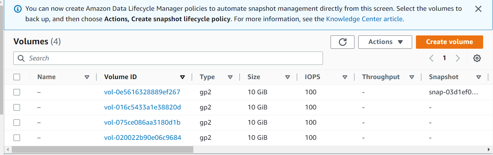

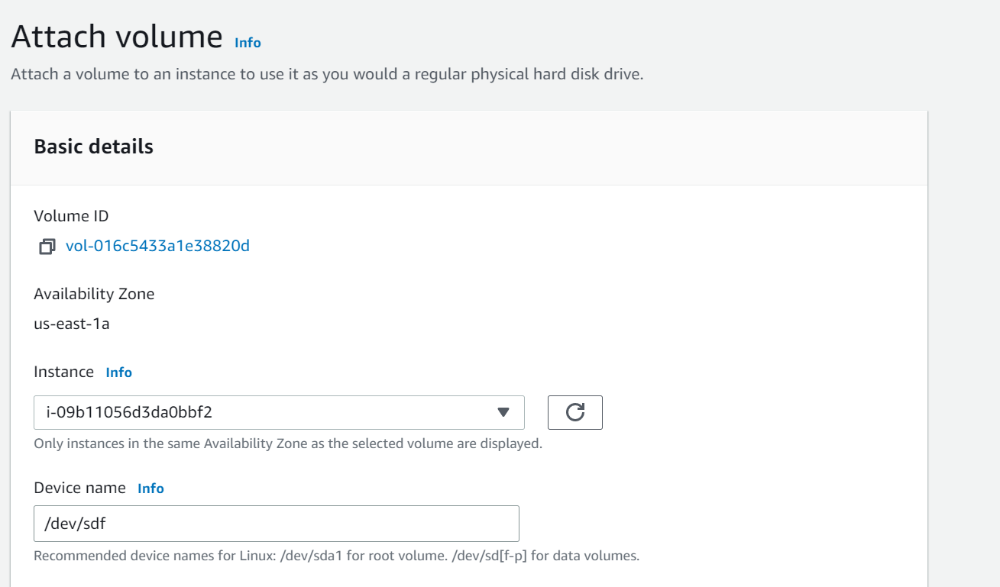

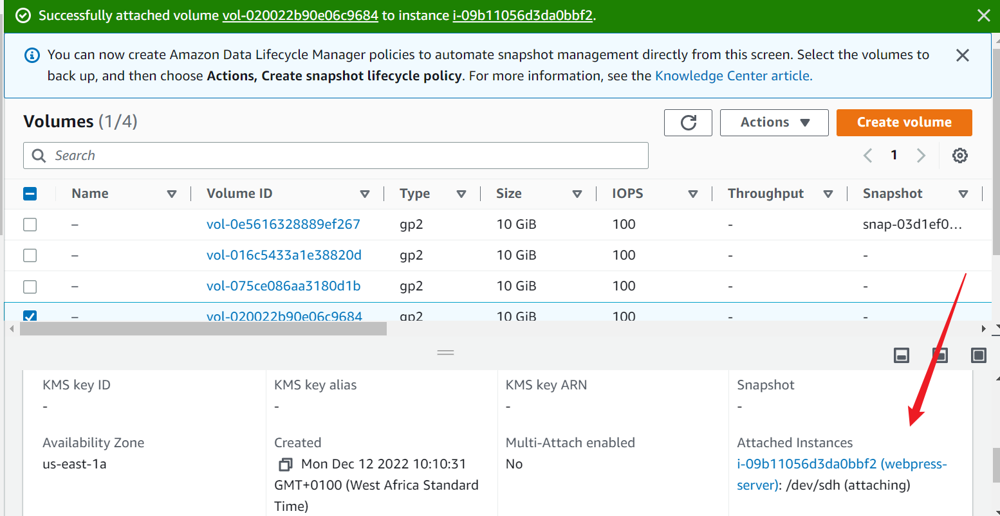

3. Use lsblk command to inspect what block devices are attached to the server. Notice names of your newly created devices. All devices in Linux reside in /dev/ directory. Inspect it with `ls /dev/` and make sure you see all 3 newly created block devices there.

`$ sudo lsblk`

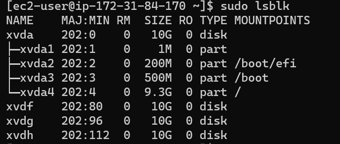

4. Use `df -h` command to see all mounts and free space on your server

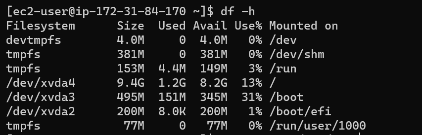

5. Use gdisk utility to create a single partition on **each** of the 3 disks

`$ sudo gdisk /dev/xvdf`

Follow the prompts with an *'n'*'enter'x4, then *'p'* and a *'w'* to write and save.
```
Output
GPT fdisk (gdisk) version 1.0.7

Partition table scan:
  MBR: not present
  BSD: not present
  APM: not present
  GPT: not present

Creating new GPT entries in memory.

Command (? for help): n
Partition number (1-128, default 1):
First sector (34-20971486, default = 2048) or {+-}size{KMGTP}:
Last sector (2048-20971486, default = 20971486) or {+-}size{KMGTP}:
Current type is 8300 (Linux filesystem)
Hex code or GUID (L to show codes, Enter = 8300):
Changed type of partition to 'Linux filesystem'

Command (? for help): p
Disk /dev/xvdf: 20971520 sectors, 10.0 GiB
Sector size (logical/physical): 512/512 bytes
Disk identifier (GUID): 99AE947C-5B69-418D-A201-E14667099A0B
Partition table holds up to 128 entries
Main partition table begins at sector 2 and ends at sector 33
First usable sector is 34, last usable sector is 20971486
Partitions will be aligned on 2048-sector boundaries
Total free space is 2014 sectors (1007.0 KiB)

Number  Start (sector)    End (sector)  Size       Code  Name
   1            2048        20971486   10.0 GiB    8300  Linux filesystem

Command (? for help): w

Final checks complete. About to write GPT data. THIS WILL OVERWRITE EXISTING
PARTITIONS!!

Do you want to proceed? (Y/N): y
OK; writing new GUID partition table (GPT) to /dev/xvdf.
The operation has completed successfully.
```
When you're done run, the command below to see the changes that's happened.

`$ sudo gdisk -l /dev/xvdf`

Repeat the same process for the other drives i.e /dev/xvdg and /dev/xvdh. 

6. Use `lsblk` utility to view the newly configured partition on each of the 3 disks.

7. Install lvm2 package using 
   
`sudo yum install lvm2`

Then run this to check if the installation went well.
`$ which lvm`

To check for available partitions, run;
`sudo lvmdiskscan`

```
Output
/dev/xvda2 [     200.00 MiB]
  /dev/xvda3 [     500.00 MiB]
  /dev/xvda4 [       9.31 GiB]
  /dev/xvdf1 [     <10.00 GiB]
  /dev/xvdg1 [     <10.00 GiB]
  /dev/xvdh1 [     <10.00 GiB]
  0 disks
  6 partitions
  0 LVM physical volume whole disks
  0 LVM physical volumes
  ```
8. Use pvcreate utility to mark each of 3 disks as physical volumes (PVs) to be used by LVM
   
`sudo pvcreate /dev/xvdf1 /dev/xvdg1 /dev/xvdh1`

```
Output:

Physical volume "/dev/xvdf1" successfully created.
Physical volume "/dev/xvdg1" successfully created.
 Physical volume "/dev/xvdh1" successfully created.
 ```
 Verify that your Physical volume has been created successfully by running:

`$ sudo pvs`
```
Output:

PV         VG Fmt  Attr PSize   PFree
  /dev/xvdf1    lvm2 ---  <10.00g <10.00g
  /dev/xvdg1    lvm2 ---  <10.00g <10.00g
  /dev/xvdh1    lvm2 ---  <10.00g <10.00g
  ```
  
9. Use vgcreate utility to add all 3 PVs to a volume group (VG). Name the VG *"webdata-vg"*
`sudo vgcreate webdata-vg /dev/xvdh1 /dev/xvdg1 /dev/xvdf1`

```
Output:
Volume group "webdata-vg" successfully created
```
Verify that your VG has been created successfully by running

 `sudo vgs`
```
Output:
 VG         #PV #LV #SN Attr   VSize   VFree
  webdata-vg   3   0   0 wz--n- <29.99g <29.99g
  ```
10. Use lvcreate utility to create 2 logical volumes. apps-lv (Use half of the PV size), and logs-lv Use the remaining space of the PV size.
> NOTE: apps-lv will be used to store data for the Website while, logs-lv will be used to store data for logs.

`sudo lvcreate -n apps-lv -L 14G webdata-vg`
```
Output:

Logical volume "apps-lv" created.
```
`sudo lvcreate -n logs-lv -L 14G webdata-vg`
```
Output:

Logical volume "logs-lv" created.
```

Verify that your Logical Volume has been created successfully by running

`sudo lvs`
```
Output:

 LV      VG         Attr       LSize  Pool Origin Data%  Meta%  Move Log Cpy%Sync Convert
  apps-lv webdata-vg -wi-a----- 14.00g
  logs-lv webdata-vg -wi-a----- 14.00g
```

Verify the entire setup:

`sudo vgdisplay -v #view complete setup - VG, PV, and LV`


`$ sudo lsblk`

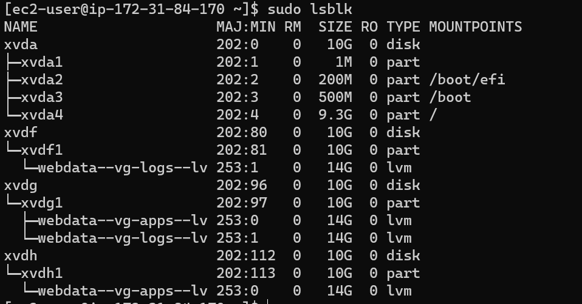

11. Use mkfs.ext4 to format the logical volumes with ext4 filesystem
 
`sudo mkfs -t ext4 /dev/webdata-vg/apps-lv`

`sudo mkfs -t ext4 /dev/webdata-vg/logs-lv`
 
12. Create /var/www/html directory to store website files
 
`sudo mkdir -p /var/www/html`
 
13. Create /home/recovery/logs to store backup of log data
 
`sudo mkdir -p /home/recovery/logs`

14. Mount */var/www/html * on *apps-lv* logical volume
 
`sudo mount /dev/webdata-vg/apps-lv /var/www/html/`

15. Use rsync utility to back up all the files in the log directory /var/log into /home/recovery/logs (This is required before mounting the file system)
 
`sudo rsync -av /var/log/. /home/recovery/logs/`

16. Mount */var/log* on *logs-lv* logical volume. 
>Note that all the existing data on /var/log will be deleted. This is why the above step is paramount.

`sudo mount /dev/webdata-vg/logs-lv /var/log`
 
17. Restore log files back into /var/log directory
 
`sudo rsync -av /home/recovery/logs/. /var/log`

18. Update /etc/fstab file so that the mount configuration will persist after restart of the server.

 >The UUID of the device will be used to update the /etc/fstab file;

`sudo blkid`

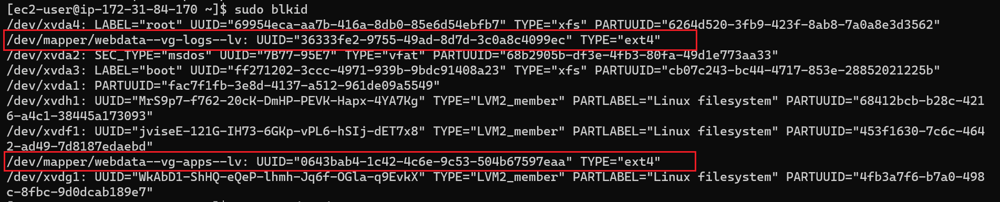

19. Update /etc/fstab in this format using your own UUID and rememeber to remove the leading and ending quotes.

`sudo vi /etc/fstab`

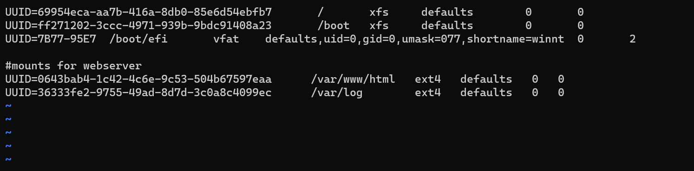

20. Test the configuration and reload the daemon
 
 `sudo mount -a`
 
 `sudo systemctl daemon-reload`
 
Verify your setup by running `df -h` output must look like this:

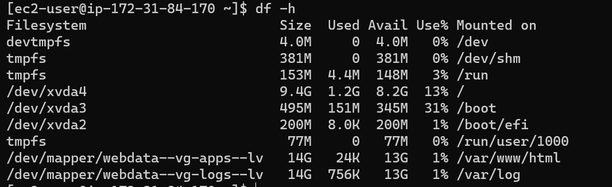

### Step 2 — Prepare the Database Server
Launch a second RedHat EC2 instance that will have a role – *‘DB Server’*
Repeat the same steps as for the Web Server, but instead of *apps-lv* create *db-lv *and mount it to */db *directory instead of */var/www/html/*.
You should end up with something like this:

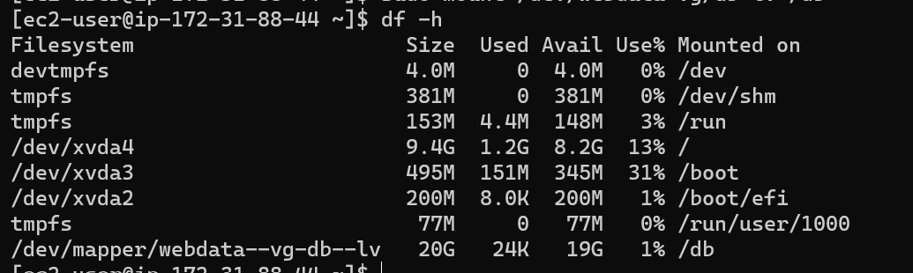

### Step 3 — Install Wordpress on your Web Server

1. Firstly update the server

`sudo yum -y update`

2. Install wget, Apache and it’s dependencies and start Apache.

`sudo yum -y install wget httpd php php-mysqlnd php-fpm php-json`

```
sudo systemctl enable httpd
sudo systemctl start httpd
```

3. Install PHP and it’s depemdencies and restart Apache.

```
sudo yum install https://dl.fedoraproject.org/pub/epel/epel-release-latest-8.noarch.rpm
sudo yum install yum-utils http://rpms.remirepo.net/enterprise/remi-release-8.rpm
sudo yum module list php
sudo yum module reset php
sudo yum module enable php:remi-7.4
sudo yum install php php-opcache php-gd php-curl php-mysqlnd
sudo systemctl start php-fpm
sudo systemctl enable php-fpm
setsebool -P httpd_execmem 1
```
4. Restart Apache
`sudo systemctl restart httpd`
 
5. Download wordpress and copy wordpress to var/www/html
  ```
  mkdir wordpress
  cd   wordpress
  sudo wget http://wordpress.org/latest.tar.gz
  sudo tar xzvf latest.tar.gz
  sudo rm -rf latest.tar.gz
  cp wordpress/wp-config-sample.php wordpress/wp-config.php
  cp -R wordpress /var/www/html/
  ```
 
6. Configure SELinux Policies
 ```
  sudo chown -R apache:apache /var/www/html/wordpress
  sudo chcon -t httpd_sys_rw_content_t /var/www/html/wordpress -R
  sudo setsebool -P httpd_can_network_connect=1
  sudo setsebool -P httpd_can_network_connect_db 1
  ```

### Step 4 — Install MySQL on both servers
`sudo yum update`
`sudo yum install mysql-server`

Verify that the service is up and running by using 

`sudo systemctl status mysqld`

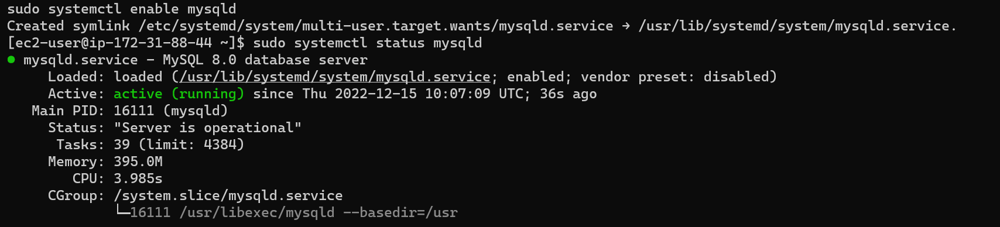

if it is not running, restart the service and enable it so it will be running even after reboot:

`sudo systemctl restart mysqld`
`sudo systemctl enable mysqld`

### Step 5 — Configure DB to work with WordPress
```
sudo mysql
CREATE DATABASE wordpress;
CREATE USER `myuser`@`<Web-Server-Private-IP-Address>` IDENTIFIED BY 'mypass';
GRANT ALL ON wordpress.* TO 'myuser'@'<Web-Server-Private-IP-Address>';
FLUSH PRIVILEGES;
SHOW DATABASES;
exit
```
```
Output:
Welcome to the MySQL monitor.  Commands end with ; or \g.
Your MySQL connection id is 8
Server version: 8.0.30 Source distribution

Copyright (c) 2000, 2022, Oracle and/or its affiliates.

Oracle is a registered trademark of Oracle Corporation and/or its
affiliates. Other names may be trademarks of their respective
owners.

Type 'help;' or '\h' for help. Type '\c' to clear the current input statement.

mysql> CREATE DATABASE wordpress;
Query OK, 1 row affected (0.00 sec)

mysql> CREATE USER `wordpress`@`%` IDENTIFIED BY 'mypass';
Query OK, 0 rows affected (0.02 sec)

mysql> GRANT ALL ON *.* TO 'wordpress'@'%' with grant option;
Query OK, 0 rows affected (0.06 sec)

mysql> FLUSH PRIVILEGES;
Query OK, 0 rows affected (0.01 sec)

mysql> SHOW DATABASES;
+--------------------+
| Database           |
+--------------------+
| information_schema |
| mysql              |
| performance_schema |
| sys                |
| wordpress          |
+--------------------+
5 rows in set (0.01 sec)

mysql> exit
```
Restart mysql service

`sudo systemctl restart mysqld`

### Step 6 — Configure WordPress to connect to the remote database.

>Hint: Do not forget to open MySQL port 3306 on DB Server EC2. For extra security, you shall allow access to the DB server ONLY from your Web Server’s IP address, so in the Inbound Rule configuration specify source as /32

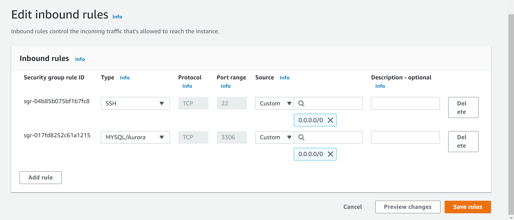

1. Test that you can connect from your Web Server to your DB server.

`sudo mysql -u admin -p -h <DB-Server-Private-IP-address>`

2. Verify if you can successfully execute SHOW DATABASES; command and see a list of existing databases.

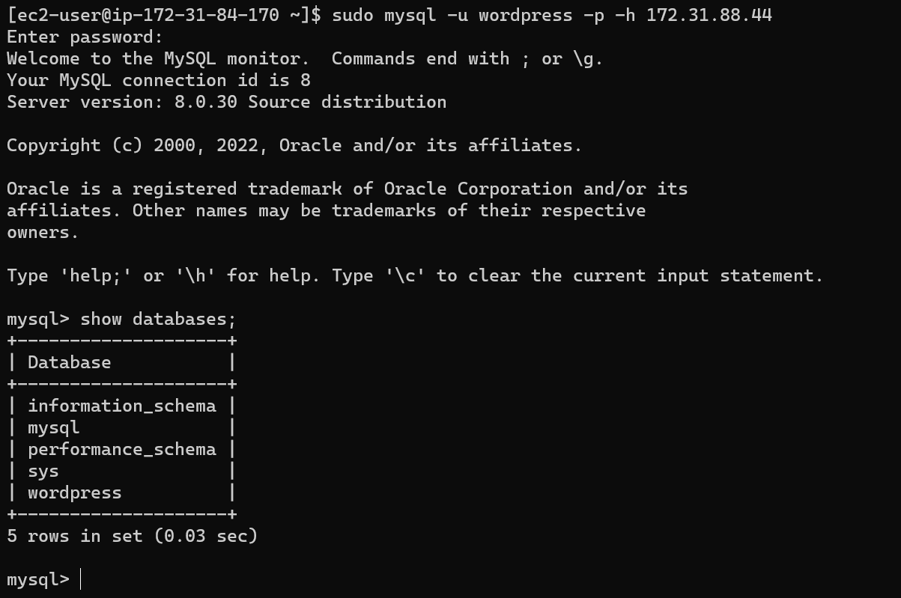

3. Change permissions and configuration so Apache could use WordPress.
    
`sudo chown -R apache:apache /var/www/html/`

`sudo systemctl restart httpd`

4. Delete the default apache page and replace with by running this command in your /var/www/html folder. Then restart apache.

`sudo mv /etc/httpd/conf.d/welcome.conf /etc/httpd/conf.d/welcome.conf_backup`

5. Edit the wp-config.php file to contain details about the remote db i.e database_name, database_user, database_password and database_host (private ip of database server in this case)
  
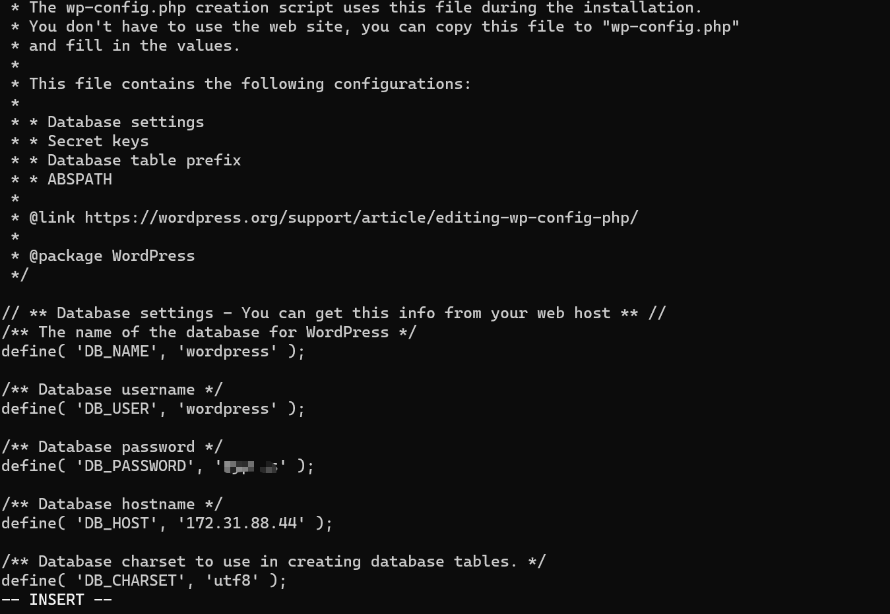

6. Enable TCP port 80 in Inbound Rules configuration for your Web Server EC2 (enable from everywhere 0.0.0.0/0 or from your workstation’s IP)

7. Configure db-server bind address in /etc/my.cnf
  `sudo vi /etc/my.cnf`

  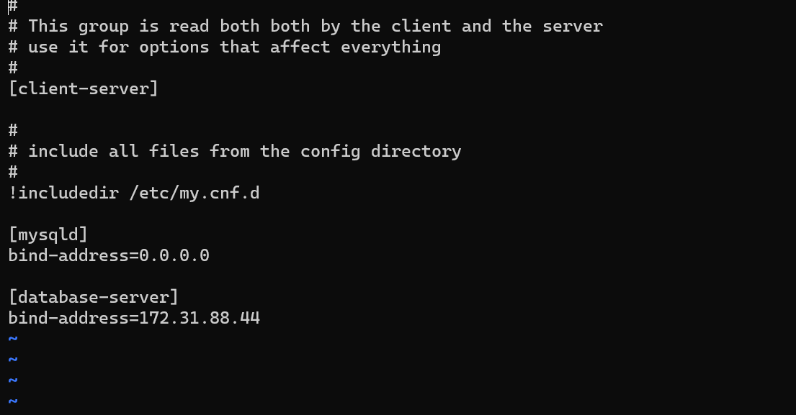


8. Try to access from your browser the link to your WordPress <http://Web-Server-Public-IP-Address/wordpress/>

You should see something like this:

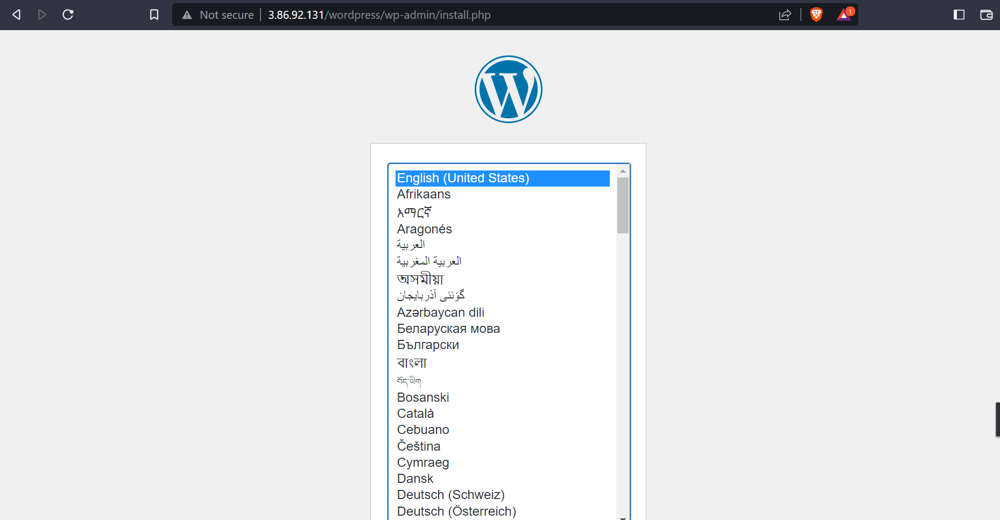

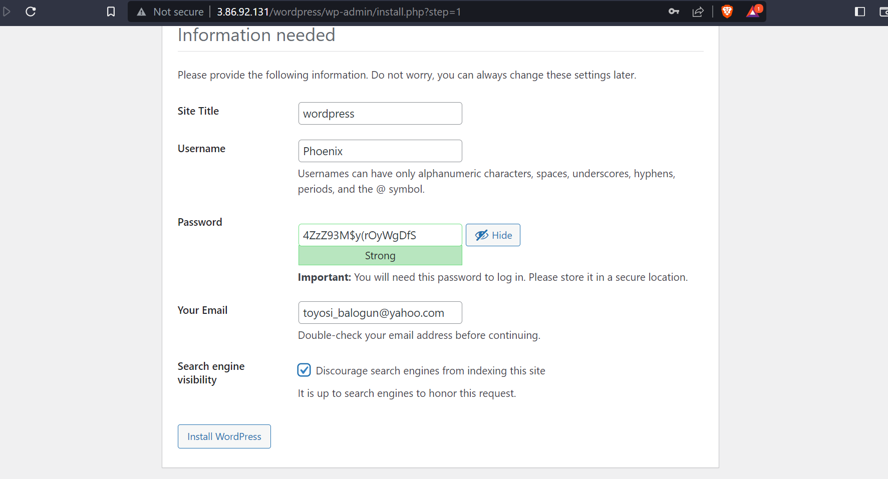

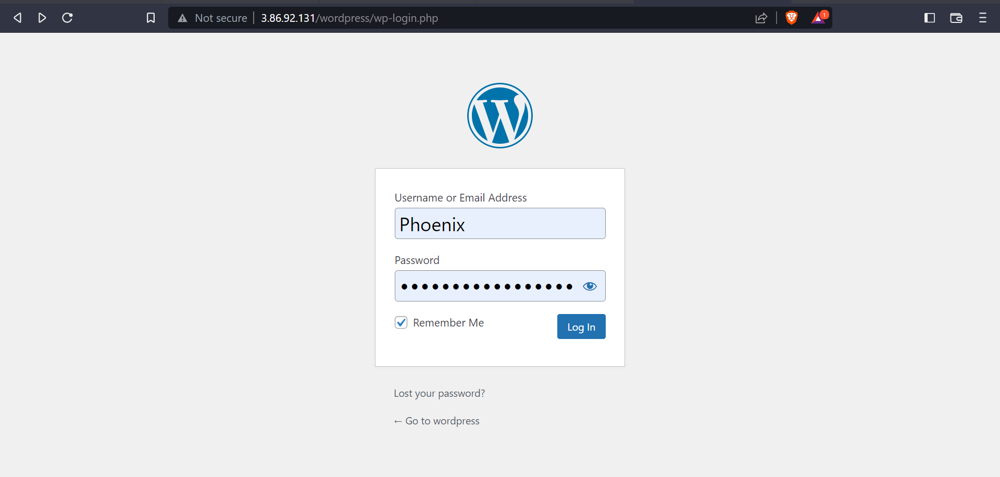

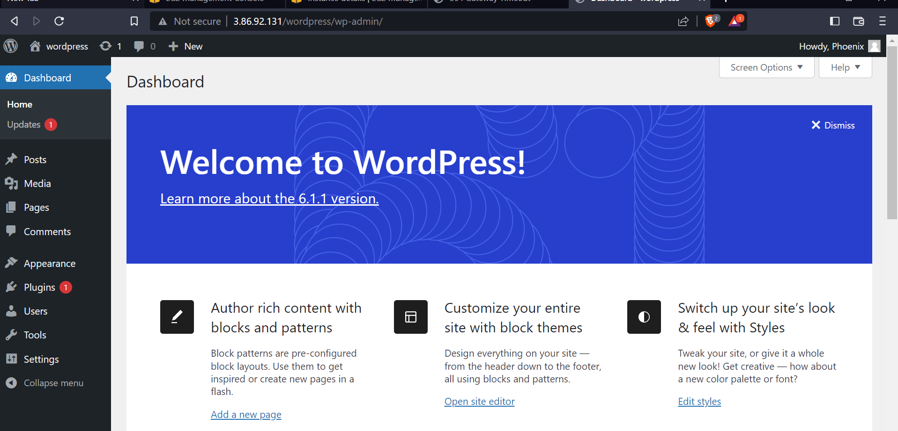
  
### CONGRATULATIONS!
You have learned how to configure Linux storage susbystem and have also deployed a full-scale Web Solution using WordPress CMS and MySQL RDBMS!


